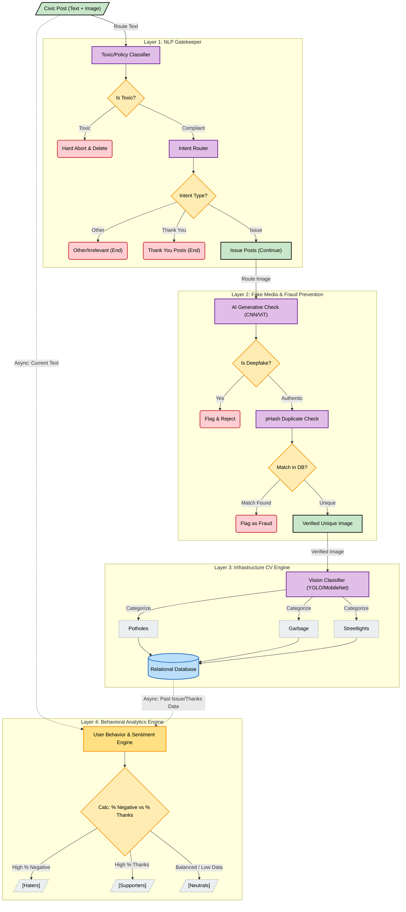
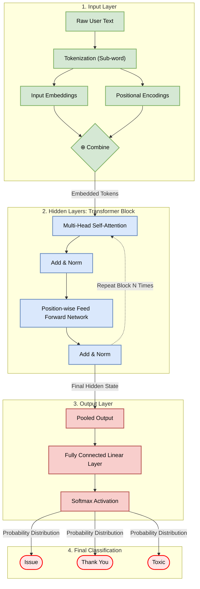

# Civic-Issue-Reporting
## model working flow 

##1. Text Moderation & Routing (BERT / Gemma-2B) -> Toxic/Policy Classifier
*  Yeh model text ko samajhne ke liye Transformer architecture ka use karta hai. Is prompt se aapko Multi-Head Attention mechanism ki mapping milegi.

