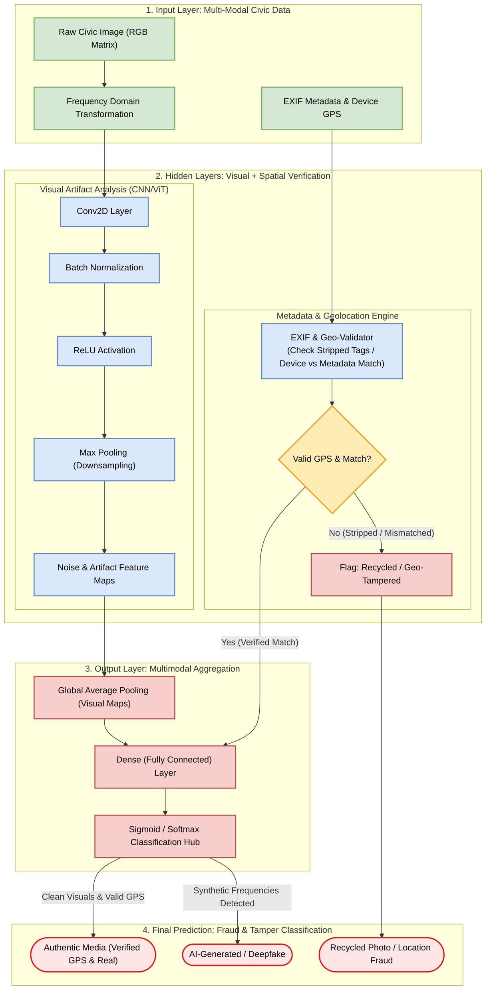
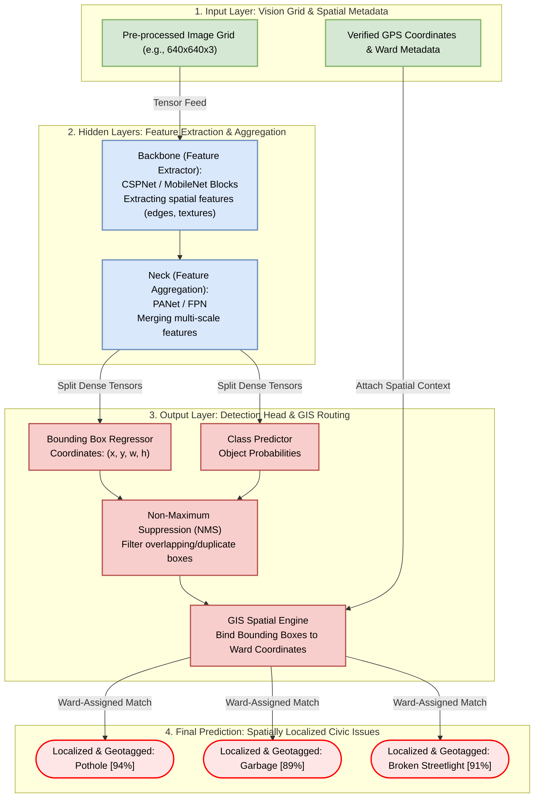
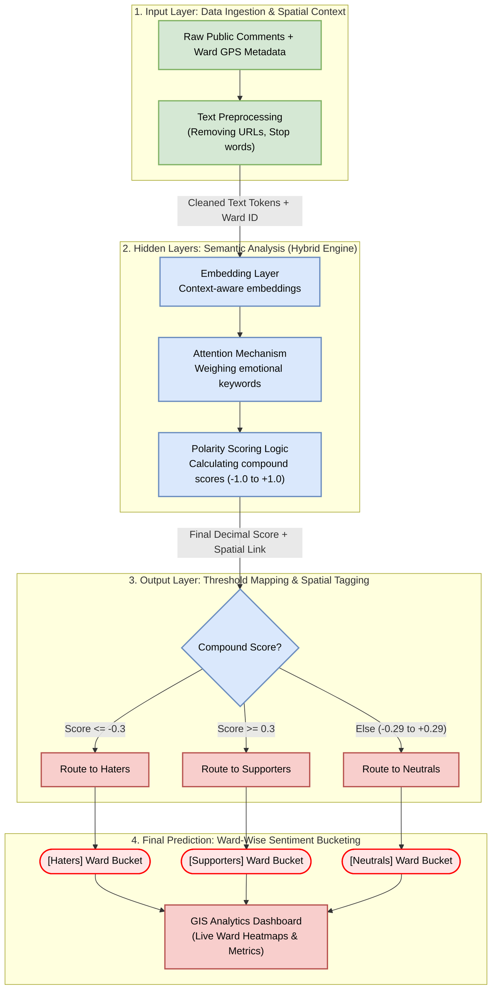

# Civic-Issue-Reporting
##app work flow

```mermaid
graph TD
    %% ==========================================
    %% GLOBAL STYLING (DARK THEME OPTIMIZED)
    %% ==========================================
    %% 1. Default edge style (Brighter Grey for Dark Backgrounds)
    linkStyle default stroke:#cfd8dc,stroke-width:2px,fill:none;

    %% 2. Node Classes (Brighter Fills, Darker Strokes, Black Text)
    classDef std fill:#82b1ff,stroke:#002171,stroke-width:2px,color:#000
    classDef dec fill:#ff80ab,stroke:#880e4f,stroke-width:2px,color:#000
    classDef db fill:#ffff8d,stroke:#e65100,stroke-width:2px,color:#000

    %% ==========================================
    %% PHASE 1: GATEKEEPER ENGINE
    %% ==========================================
    N1["START: User<br>Submits Post"]:::std --> N2["Post Type:<br>Issue or<br>Thank You"]:::std
    N2 --> N3["Step 1: Content<br>Gatekeeper Engine"]:::std
    N3 --> N4["Policy/Abuse Violation Security<br>Anti-spam/bot<br>Anti-Abuse<br>People-friendly"]:::std
    N4 --> D1{"Spam, Abuse, Policy<br>Violation Present?"}:::dec

    %% DECISION 1 PATHS
    D1 -->|"Yes (Spam)"| E1["Terminated<br>Session"]:::std
    D1 -->|"No (Clean)"| D_Type{"Is Content an<br>Issue or Friendly?"}:::dec

    %% NEW ROUTING: FRIENDLY VS ISSUE
    D_Type -->|"Civic Issue"| N5["Step 2: Fake<br>Media<br>Detection"]:::std
    D_Type -->|"Friendly Data<br>& Thank You"| CentralDB[("Central Database")]:::db

    %% ==========================================
    %% PHASE 2: FAKE MEDIA DETECTION
    %% ==========================================
    N5 --> N6["Check: AI-generated media /<br>Old recycled photo/video"]:::std
    N6 --> D2{"Fake or<br>Duplicated?"}:::dec

    %% DECISION 2 & 3 PATHS
    D2 -->|"Yes"| D3{"Fake or<br>Fraud?"}:::dec
    D3 --> N7["Flag for<br>Review"]:::std
    D3 --> N8["Automated<br>Reject"]:::std
    
    N7 --> BRE1["END: Post<br>Removed /<br>Flagged"]:::std
    N8 --> BRE2["END: Post<br>Removed"]:::std

    %% ==========================================
    %% NEW PHASE 2.5: GEOTAGGING & ROUTING
    %% ==========================================
    D2 -->|"No (Authentic)"| N_Geo["Step 2.5: Geotag Extraction<br>& Routing Engine"]:::std
    N_Geo --> D_Geo{"Is GPS Valid<br>& Match EXIF?"}:::dec
    
    D_Geo -->|"No (Spoofed/Missing)"| GeoReject["Reject: Location Invalid<br>or Spoofed"]:::std
    D_Geo -->|"Yes (Verified)"| N_Assign["GIS Mapping:<br>Auto-Assign to Local Ward Authority"]:::std

    N_Assign --> N9["Step 3: Central<br>Database &<br>Analytics Hub"]:::std

    %% ==========================================
    %% PHASE 3: SENTIMENT & PERCEPTION
    %% ==========================================
    N9 --> N10["Log Post /<br>Update Issue ID<br>Status"]:::std
    N10 --> N11["Sentiment Observation<br>Engine<br>(VADER/TextBlob/<br>BERT NLP)"]:::std
    N11 --> N12["Public<br>Perception<br>Categories"]:::std
    
    N12 --> P1A["Neutrals"]:::std
    N12 --> P1B["Supporters"]:::std
    N12 --> P1C["Haters"]:::std
    
    P1A --> N13["Merge Category<br>Analysis"]:::std
    P1B --> N13
    P1C --> N13

    %% ==========================================
    %% PHASE 4: GOVERNMENT & CITIZEN PORTAL
    %% ==========================================
    N13 --> N14["Step 4: Government<br>Control Site<br>Admin View Local"]:::std
    N14 --> N15["Authorized<br>Officers"]:::std
    N15 --> N16["Visibility Toggle:<br>LOCAL / STATE Level"]:::std
    N16 --> N17["Step 5: Public<br>Viewer Status<br>Portal"]:::std

    %% DIRECT ROUTE FOR FRIENDLY CONTENT TO STEP 5
    CentralDB -->|"Publish directly<br>to Portal"| N17

    N17 --> N18["Secure Citizen<br>Login"]:::std
    N18 --> N19["Track Only Their<br>Problem.<br>Where is my post?"]:::std
    N19 --> N20["Status<br>Updates:"]:::std

    N20 --> P2A["Under<br>Process"]:::std
    N20 --> P2B["Solved"]:::std

    P2A --> N21["Step 6:<br>Automated Status<br>Report Creator"]:::std
    P2B --> N21

    %% ==========================================
    %% PHASE 5: FINAL DECISION
    %% ==========================================
    N21 --> D4{"Solved at Local<br>Level?"}:::dec

    D4 -.->|"No"| N22["Auto-Escalates /<br>Email status report to<br>higher level authority.<br>No local level permission<br>needed."]:::std
    N22 --> T1["END:<br>Escalated"]:::std

    D4 -->|"Yes"| N23["Update<br>Status: Solved"]:::std
    N23 --> N24["Push to<br>Central<br>Database"]:::std
    N24 --> T2["END:<br>Resolved"]:::std

    %% ==========================================
    %% NEW SENTIMENT DB CONNECTIONS
    %% ==========================================
    CentralDB -.->|"Fetch Past Data"| N11
    N13 -->|"Push Result to DB"| CentralDB

    %% ==========================================
    %% LINK STYLING (Neon Green/Red Logic Arrows)
    %% ==========================================
    %% Note: Absolute numbering dynamically matches the current tree structure.
    
    %% D1 Yes (Spam) -> Bright Red
    linkStyle 4 stroke:#ff1744,stroke-width:2px;
    %% D1 No (Clean) -> Bright Green
    linkStyle 5 stroke:#00e676,stroke-width:2px;
    
    %% D2 Yes (Fake) -> Bright Red
    linkStyle 10 stroke:#ff1744,stroke-width:2px;
    %% D2 No (Authentic) -> Bright Green
    linkStyle 15 stroke:#00e676,stroke-width:2px;

    %% D_Geo No (Spoofed) -> Bright Red
    linkStyle 17 stroke:#ff1744,stroke-width:2px;
    %% D_Geo Yes (Verified) -> Bright Green
    linkStyle 18 stroke:#00e676,stroke-width:2px;
    
    %% D4 No (Escalate) -> Bright Red Dashed
    linkStyle 42 stroke:#ff1744,stroke-width:2px,stroke-dasharray: 5 5;
    %% D4 Yes (Solved) -> Bright Green
    linkStyle 44 stroke:#00e676,stroke-width:2px;
```

## model working flow 

```mermaid
graph TD
    %% ==========================================
    %% GLOBAL STYLING (DARK THEME OPTIMIZED)
    %% ==========================================
    linkStyle default stroke:#cfd8dc,stroke-width:2px,fill:none;

    classDef input fill:#69f0ae,stroke:#1b5e20,stroke-width:2px,color:#000;
    classDef model fill:#e040fb,stroke:#4a148c,stroke-width:2px,color:#000;
    classDef decision fill:#ffd740,stroke:#e65100,stroke-width:2px,color:#000;
    classDef terminal fill:#ff5252,stroke:#b71c1c,stroke-width:2px,color:#000;
    classDef db fill:#40c4ff,stroke:#01579b,stroke-width:2px,color:#000;
    classDef bucket fill:#cfd8dc,stroke:#37474f,stroke-width:2px,stroke-dasharray: 3 3,color:#000;
    classDef engine fill:#ffab40,stroke:#e65100,stroke-width:2px,color:#000;

    %% ----- 1. USER INPUT -----
    Input[/"Civic Post (Text + Image + GPS)"/]:::input

    %% ----- 2. LAYER 1: NLP GATEKEEPER -----
    subgraph Layer_1 ["Layer 1: NLP Gatekeeper"]
        direction TB
        ToxicClass["Toxic/Policy Classifier"]:::model
        CheckToxic{"Is Toxic?"}:::decision
        Abort("Hard Abort & Delete"):::terminal
        IntentRouter["Intent Router"]:::model
        CheckIntent{"Intent Type?"}:::decision
        OtherPosts("Other/Irrelevant (End)"):::terminal
        ThankYou("Thank You Posts (End)"):::terminal
        IssuePosts["Issue Posts (Continue)"]:::input
    end

    Input -->|"Route Text"| ToxicClass
    ToxicClass --> CheckToxic
    CheckToxic -->|"Toxic"| Abort
    CheckToxic -->|"Compliant"| IntentRouter
    IntentRouter --> CheckIntent
    CheckIntent -->|"Thank You"| ThankYou
    CheckIntent -->|"Other"| OtherPosts
    CheckIntent -->|"Issue"| IssuePosts

    %% ----- 3. LAYER 2: FAKE MEDIA & FRAUD PREVENTION -----
    subgraph Layer_2 ["Layer 2: Fake Media & Fraud Prevention"]
        direction TB
        GenCheck["AI Generative Check (CNN/ViT)"]:::model
        CheckDeepfake{"Is Deepfake?"}:::decision
        RejectFake("Flag & Reject"):::terminal
        pHash["pHash Duplicate Check"]:::model
        CheckDB{"Match in DB?"}:::decision
        RejectFraud("Flag as Fraud"):::terminal
        UniqueImage["Verified Unique Image"]:::input
    end

    IssuePosts -->|"Route Image"| GenCheck
    GenCheck --> CheckDeepfake
    CheckDeepfake -->|"Yes"| RejectFake
    CheckDeepfake -->|"Authentic"| pHash
    pHash --> CheckDB
    CheckDB -->|"Match Found"| RejectFraud
    CheckDB -->|"Unique"| UniqueImage

    %% ----- 3.5 LAYER 2.5: GEOTAG & SPATIAL ENGINE -----
    subgraph Layer_2_5 ["Layer 2.5: Geotag & Spatial Engine"]
        direction TB
        GeoExtract["Spatial Extractor<br>(EXIF vs Live GPS)"]:::model
        CheckGeo{"Is Location<br>Valid?"}:::decision
        RejectGeo("Flag & Reject<br>(Spoofed GPS)"):::terminal
        SpatialDedup["Spatial Clustering<br>(Radius Deduplication)"]:::model
        GeoVerified["Spatially Verified<br>Image & Data"]:::input
    end

    UniqueImage -->|"Extract Coordinates"| GeoExtract
    GeoExtract --> CheckGeo
    CheckGeo -->|"Invalid / Spoofed"| RejectGeo
    CheckGeo -->|"Valid Match"| SpatialDedup
    SpatialDedup -->|"Assign GIS Zone"| GeoVerified

    %% ----- 4. LAYER 3: INFRASTRUCTURE CV ENGINE -----
    subgraph Layer_3 ["Layer 3: Infrastructure CV Engine"]
        direction TB
        VisionClass["Vision Classifier (YOLO/MobileNet)"]:::model
        CatPotholes["Potholes"]:::bucket
        CatGarbage["Garbage"]:::bucket
        CatLights["Streetlights"]:::bucket
        FinalDB[("Central Relational Database<br>+ GIS Data")]:::db
    end

    GeoVerified -->|"Verified Tensor"| VisionClass
    VisionClass -->|"Categorize"| CatPotholes
    VisionClass -->|"Categorize"| CatGarbage
    VisionClass -->|"Categorize"| CatLights
    
    %% Save classified issues and clean text to DB
    CatPotholes -->|"Save Issue + GPS"| FinalDB
    CatGarbage -->|"Save Issue + GPS"| FinalDB
    CatLights -->|"Save Issue + GPS"| FinalDB
    IssuePosts -.->|"Save Clean Text"| FinalDB

    %% ----- 5. LAYER 4: BEHAVIORAL ANALYTICS -----
    subgraph Layer_4 ["Layer 4: Behavioral Analytics Engine"]
        direction TB
        BehaviorEngine["User Behavior & Sentiment Engine"]:::engine
        RatioCalc{"Calc: % Negative vs % Thanks"}:::decision
        Haters[/"[Haters]"/]:::bucket
        Supporters[/"[Supporters]"/]:::bucket
        Neutrals[/"[Neutrals]"/]:::bucket
    end

    %% NEW LOGIC: Engine ONLY pulls from DB, not from Input
    FinalDB -.->|"Fetch Text & Past Data<br>(Async Batch Process)"| BehaviorEngine
    
    BehaviorEngine --> RatioCalc
    RatioCalc -->|"High % Negative"| Haters
    RatioCalc -->|"High % Thanks"| Supporters
    RatioCalc -->|"Balanced / Low Data"| Neutrals

    %% NEW LOGIC: Push results back to DB
    Haters -->|"Update DB Status"| FinalDB
    Supporters -->|"Update DB Status"| FinalDB
    Neutrals -->|"Update DB Status"| FinalDB

    %% ==========================================
    %% SUBGRAPH TRANSPARENCY & DARK TEXT FIX
    %% ==========================================
    style Layer_1 fill:transparent,stroke:#90a4ae,stroke-width:2px,stroke-dasharray: 5 5,color:#ffffff
    style Layer_2 fill:transparent,stroke:#90a4ae,stroke-width:2px,stroke-dasharray: 5 5,color:#ffffff
    style Layer_2_5 fill:transparent,stroke:#90a4ae,stroke-width:2px,stroke-dasharray: 5 5,color:#ffffff
    style Layer_3 fill:transparent,stroke:#90a4ae,stroke-width:2px,stroke-dasharray: 5 5,color:#ffffff
    style Layer_4 fill:transparent,stroke:#90a4ae,stroke-width:2px,stroke-dasharray: 5 5,color:#ffffff
```

## 1. Text Moderation & Routing (BERT / Gemma-2B) -> Toxic/Policy Classifier
*  Yeh model text ko samajhne ke liye Transformer architecture ka use karta hai. Is prompt se aapko Multi-Head Attention mechanism ki mapping milegi.

## 2. Fake Media & Fraud Detection (CNN / Vision Transformer)
*  Yeh model deepfakes ya AI-generated noise pakadne ke liye image ki deep structural frequencies ko analyze karta hai.

## 3. Civic Issue Classification (YOLOv8 / MobileNetV2)
*  Object detection aur classification models (jaise YOLO) ka structure simple CNN se thoda alag hota hai kyunki inhein objects ki location (bounding boxes) bhi predict karni hoti hai.

## 4. Sentiment Analytics Engine (VADER / RoBERTa)
*  Yeh system background mein chalta hai. Agar model RoBERTa (Deep Learning) hai, toh architecture BERT jaisa hoga, par agar VADER (Lexicon/Rule-based) use ho raha hai, toh internal logic math aur dictionaries par base hoga.

## work flow of all layer together

```mermaid
graph TD
    %% ==========================================
    %% GLOBAL STYLING (DARK THEME OPTIMIZED)
    %% ==========================================
    classDef infra fill:#ffb74d,stroke:#e65100,stroke-width:2px,color:#000;
    classDef ai fill:#64b5f6,stroke:#0d47a1,stroke-width:2px,color:#000;
    classDef db fill:#fff176,stroke:#f57f17,stroke-width:2px,color:#000;
    classDef client fill:#81c784,stroke:#1b5e20,stroke-width:2px,color:#000;

    %% Make arrows clearly visible on dark background
    linkStyle default stroke:#b0bec5,stroke-width:2px,fill:none;

    %% ==========================================
    %% 1. CLIENT & EDGE INGESTION
    %% ==========================================
    subgraph L0 ["Client & Edge Ingestion"]
        direction TB
        MC["Mobile Client"]:::client
        API["AWS API Gateway"]:::infra
        K_Sync["Kafka Topic:<br>sync_processing"]:::infra
        K_Async["Kafka Topic:<br>async_analytics"]:::infra

        MC -- "Sends JSON<br>(Text + Image + GPS)" --> API
        API -->|"Route Block"| K_Sync
        API -->|"Route Async"| K_Async
    end

    %% ==========================================
    %% 2. LAYER 1: NLP MODERATION
    %% ==========================================
    subgraph L1 ["Layer 1: NLP Moderation (ONNX-Optimized)"]
        direction TB
        K_Cons["Kafka Consumer"]:::infra
        Redis{"Redis Cache:<br>Duplicate Text?"}:::db
        CacheResp["Return Cached Response"]:::client
        Toxic["Toxic Classifier<br>(Gemma-2B INT8)"]:::ai
        D1{"Decision 1:<br>Toxicity Score > 0.9?"}:::infra
        DLQ["Dead Letter Queue /<br>Auto-Delete"]:::infra
        Intent["Intent Router<br>(BERT-Base)"]:::ai
        ThankYou["Thank You Stream<br>(Ends)"]:::client
        Issue["Issue Stream"]:::infra

        K_Sync --> K_Cons
        K_Cons --> Redis
        Redis -- "Yes" --> CacheResp
        Redis -- "No" --> Toxic
        Toxic --> D1
        D1 -- "Yes" --> DLQ
        D1 -- "No (Compliant)" --> Intent
        Intent -- "Thank You" --> ThankYou
        Intent -- "Issue" --> Issue
    end

    %% ==========================================
    %% 3. LAYER 2: VISION SECURITY & GEOTAGGING
    %% ==========================================
    subgraph L2 ["Layer 2: Vision Security & Geotagging"]
        direction TB
        pHash["pHash Logic Engine"]:::ai
        DB_Vec[("PostgreSQL / Redis<br>Vector Store")]:::db
        D2{"Decision 2:<br>Hash Match?<br>(Hamming < 5)"}:::infra
        Fraud["Flag as Fraud"]:::client
        ViT["Generative AI Anomaly Detector<br>(ViT in TensorRT)"]:::ai
        D3{"Decision 3:<br>Is Deepfake?"}:::infra
        Reject["Reject"]:::client
        GeoEngine["Geo & Spatial Engine<br>(EXIF vs GPS & Ward Mapping)"]:::ai
        D_Geo{"Valid GPS Match?"}:::infra
        GeoReject["Reject: Spoofed / Missing GPS"]:::client
        PassAuth["Pass Spatially Verified Data to Layer 3"]:::infra

        Issue -- "Image + GPS Metadata" --> pHash
        pHash <-->|"Queries for exact matches"| DB_Vec
        pHash --> D2
        D2 -- "Yes" --> Fraud
        D2 -- "No (Unique)" --> ViT
        ViT --> D3
        D3 -- "Yes" --> Reject
        D3 -- "No (Authentic)" --> GeoEngine
        GeoEngine --> D_Geo
        D_Geo -- "No" --> GeoReject
        D_Geo -- "Yes" --> PassAuth
    end

    %% ==========================================
    %% 4. LAYER 3: CIVIC ISSUE CLASSIFICATION
    %% ==========================================
    subgraph L3 ["Layer 3: Civic Issue Classification (GPU Cluster)"]
        direction TB
        CV["Civic Vision Classifier<br>(YOLOv8/MobileNetV3 on Kubernetes Pods)"]:::ai
        BBox["Generates Bounding Boxes<br>& Confidence Scores"]:::infra
        Potholes["Potholes"]:::infra
        Dumping["Illegal Dumping"]:::infra
        Wires["Wire Hazards"]:::infra
        DB_Meta[("PostgreSQL<br>(Metadata + GIS Ward)")]:::db
        DB_S3[("AWS S3 Bucket<br>(Raw Image)")]:::db
        Push["Success Push Notification"]:::client

        PassAuth --> CV
        CV --> BBox
        BBox --> Potholes
        BBox --> Dumping
        BBox --> Wires
        
        Potholes -->|"Write Metadata + Ward"| DB_Meta
        Dumping -->|"Write Metadata + Ward"| DB_Meta
        Wires -->|"Write Metadata + Ward"| DB_Meta
        
        Potholes -->|"Write Raw Image"| DB_S3
        Dumping -->|"Write Raw Image"| DB_S3
        Wires -->|"Write Raw Image"| DB_S3

        DB_Meta -->|"Trigger"| Push
        DB_S3 -->|"Trigger"| Push
    end

    %% ==========================================
    %% 5. LAYER 4: SENTIMENT ANALYTICS
    %% ==========================================
    subgraph L4 ["Layer 4: Sentiment Analytics (Asynchronous Engine)"]
        direction TB
        SentEng["Sentiment Engine<br>(VADER + RoBERTa)"]:::ai
        Agg["Aggregates Polarity Scores<br>+ Ward Clustering"]:::infra
        Haters["Haters"]:::infra
        Neutrals["Neutrals"]:::infra
        Supporters["Supporters"]:::infra
        Dash["Live Admin Dashboard<br>(Ward Heatmaps)"]:::client

        K_Async -.->|"Async Text Feed"| SentEng
        SentEng --> Agg
        Agg --> Haters
        Agg --> Neutrals
        Agg --> Supporters
        Haters -->|"Updates Metrics"| Dash
        Neutrals -->|"Updates Metrics"| Dash
        Supporters -->|"Updates Metrics"| Dash
    end

    %% ==========================================
    %% SUBGRAPH TRANSPARENCY & DARK TEXT FIX
    %% ==========================================
    style L0 fill:transparent,stroke:#90a4ae,stroke-width:2px,stroke-dasharray: 5 5,color:#ffffff
    style L1 fill:transparent,stroke:#90a4ae,stroke-width:2px,stroke-dasharray: 5 5,color:#ffffff
    style L2 fill:transparent,stroke:#90a4ae,stroke-width:2px,stroke-dasharray: 5 5,color:#ffffff
    style L3 fill:transparent,stroke:#90a4ae,stroke-width:2px,stroke-dasharray: 5 5,color:#ffffff
    style L4 fill:transparent,stroke:#90a4ae,stroke-width:2px,stroke-dasharray: 5 5,color:#ffffff
```

