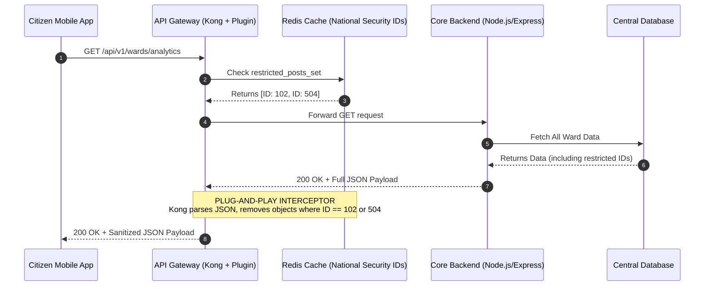

Here is the clean, professional summary formatted specifically for your `README.md`. It highlights the architectural gap, the plug-and-play solution, the engineering rationale (with the comparison table), and the sequence diagram.

You can copy and paste this directly into your documentation.

---

## National Security Visibility Controller (Plug-and-Play Security)

**The Gap:** The core architecture requires a high-priority "National Security Override" to completely mask or shadow-ban sensitive civic issues from the public.
**The Constraint:** Hardcoding a new state (e.g., `NATIONAL_SECURITY_HOLD`) into the core PostgreSQL `POSTS` table and rewiring the Node.js `auth-service` violates the Open/Closed Principle and tightly couples the system.

### The Solution: Plug-and-Play Architecture

To maintain a modular, tightly secured system, we utilize the **Feature Flag (Toggle) Pattern** via an **API Gateway Plugin**. This allows us to add or drop the security feature without modifying the internal core monolith.

* **Redis-Backed Feature Flags:** Restricted `post_id`s are stored in a high-speed Redis Set (e.g., `restricted_posts`). This avoids heavy, rigid database migrations.
* **Gateway-Level Interception:** A custom plugin at the AWS API Gateway (Kong) layer intercepts outbound responses, checks the Redis cache in milliseconds, and redacts sensitive posts before they ever reach the client.

### Architecture Decision: API Gateway (Kong) vs. Node.js Middleware

We explicitly selected the **API Gateway / Kong Plugin** approach over building a Node.js Express Middleware injector. Here is the strict engineering rationale for this decision:

| Feature | API Gateway / Kong Plugin (Chosen Architecture) | Node.js Express Middleware |
| --- | --- | --- |
| **Security (Perimeter Defense)** | **High.** If the backend is compromised, Kong still strips restricted data at the perimeter before it leaves the network. | **Low.** A backend breach (e.g., SQL injection/Prototype Pollution) allows a hacker to easily bypass the middleware. |
| **Performance & Speed** | **Ultra-Fast.** Built on Nginx/Lua, it processes JSON payload interception at C-level network speeds (milliseconds). | **Moderate.** Relies on the Node.js V8 event loop, which can bottleneck during heavy synchronous payload interception. |
| **Deployment (Plug-and-Play)** | **True Zero-Downtime.** The plugin can be toggled on/off instantly via an API call or declarative YAML config. | **Requires Redeployment.** Changing or removing the middleware requires pushing new code and restarting Kubernetes pods. |

---

### National Security Plugin Architecture (Workflow)

This sequence diagram illustrates how the API Gateway connects to Redis to filter inbound/outbound traffic seamlessly, keeping the core NLP Gatekeeper, YOLOv8 CV engine, and spatial mapping logic entirely undisturbed.

